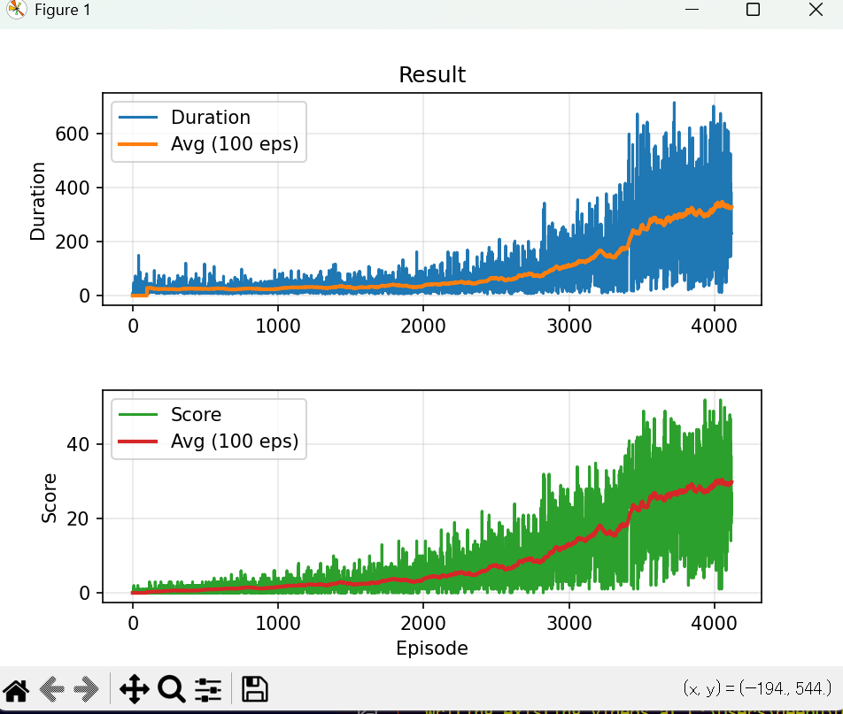
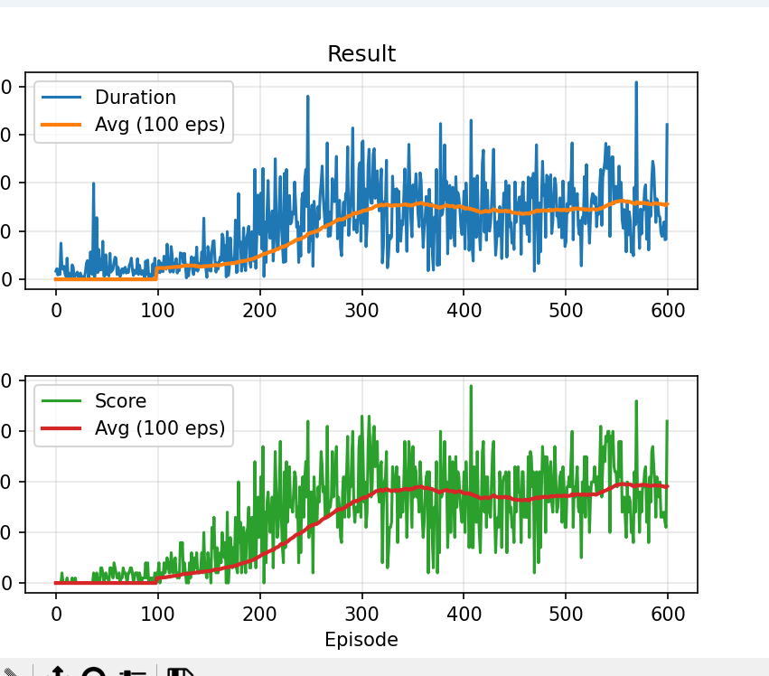

# 🐍 Snake-Gym-RL

A Reinforcement Learning project that trains an AI agent to play the classic Snake game using **Deep Q-Networks (DQN)**. The environment is custom-built using **Gymnasium** and **Pygame**, and the agent is trained using **PyTorch**.

This repository explores different training strategies, currently focusing on state-vector inputs with **Vectorized Environments**, with plans to expand into **Computer Vision (CNN)** based learning.

## 🎥 Demo

*(The AI agent playing Snake after training)*

---

## 📂 Project Structure

| File/Folder | Description |
| :--- | :--- |
| `gymnasium_env/` | Contains the custom Snake environment logic (Gymnasium wrapper). |
| `DQN_Snake.py` | Main script for training the agent using a standard, single-environment loop. |
| `DQN_vec.py` | **Optimized training script** using 4 parallel environments (Vectorized) for faster learning. |
| `test.py` | Script to load a trained model (`.pth`) and watch the agent play. |
| `snake_model_best.pth` | The saved model weights of the best-performing agent. |

---

## 📊 Performance & Results

We implemented two training approaches to compare efficiency: **Standard DQN** vs. **Vectorized DQN**. The Vectorized approach uses 4 parallel environments, allowing the agent to collect experience significantly faster.

### 🏆 Comparison Table

| Metric | Standard Training | Vectorized Training (4 Envs) |
| :--- | :--- | :--- |
| **Training Duration** | 53 Minutes | **26 Minutes** |
| **Episodes Completed**| 600 | ~4,200 |
| **Average Score** | ~30 | ~30 |
| **Efficiency** | Baseline | **~2x Faster Time / 7x More Episodes** |

### 📈 Training Graphs

#### 1. Standard Training (600 Episodes)
*Achieved an average score of 30 in 53 minutes.*


#### 2. Vectorized Training (4200 Episodes)
*Achieved similar high scores in just 26 minutes due to parallelization.*


---

## 🔮 Roadmap & Future Experiments

We are actively experimenting with different architectures and inputs. The goal is to evolve this project from simple vector-based learning to complex visual perception.

- [x] **Vector Observation**: (Current) Input is a grid of coordinates (Snake Head, Food, Body positions).
- [x] **Vectorized Environments**: Implementation of parallel training for speed.
- [ ] **Vision Mode (CNN)**: Change input from coordinates to raw RGB pixel frames. Use a Convolutional Neural Network (CNN) to "see" the board like a human.
- [ ] **PPO / A2C**: Implement Policy Gradient methods to compare stability against DQN.
- [ ] **Curriculum Learning**: Add obstacles or increase speed dynamically as the agent improves.

---

## 🛠️ Dependencies

To run this project, you need Python installed along with the following libraries:

```bash
pip install gymnasium pygame torch numpy matplotlib